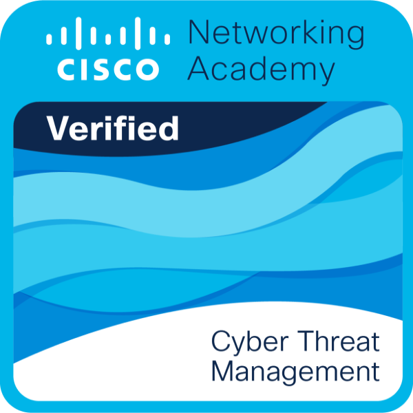
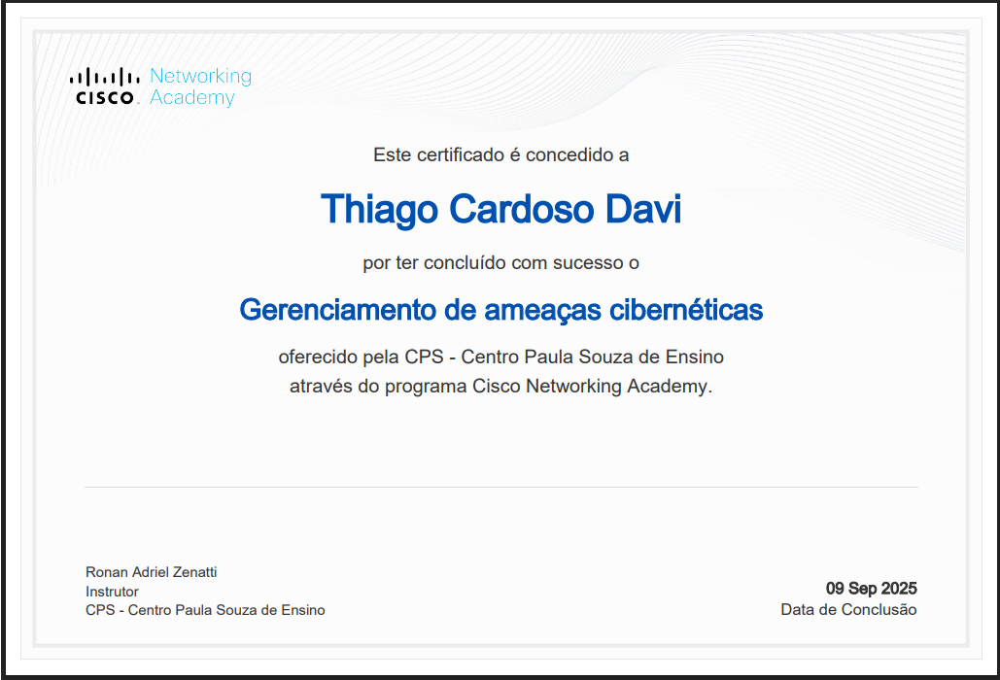

# Plano de Resposta a Incidentes e Gerenciamento de Ameaças

## 🏆 Participação na Maratona Cisco de Cibersegurança

<div align="center">
  
  
  
</div>

## Introdução
Projeto final desenvolvido como parte da 11ª Maratona Cisco de Cibersegurança, representando com orgulho a FATEC Ipiranga. Este trabalho demonstra um plano completo de segurança para um cenário de ataque simulado, aplicando os conhecimentos adquiridos durante a competição.

Foi uma grande satisfação participar desta maratona e concluí-la com sucesso, representando minha instituição e aprimorando minhas habilidades em segurança cibernética.

### 🏅 Certificação e Reconhecimento

<div align="center">
  <h3>Badge de Conclusão</h3>
  
  
  <h3>Certificado de Conclusão</h3>
  
</div>

## Estrutura do Projeto
- `evidencias_analise/`: Contém logs, alertas e capturas de rede
- `documentacao/`: Documentação detalhada do projeto

## Como Usar
1. Navegue até a pasta `documentacao` para entender o cenário
2. Analise as evidências na pasta `evidencias_analise`
3. Consulte os relatórios pós-incidente para entender as ações tomadas

## Requisitos
- Python 3.8+
- Bibliotecas listadas em `requirements.txt`

## Instalação
```bash
pip install -r requirements.txt
```

## Agradecimentos

Gostaria de expressar minha gratidão:
- À **Cisco** pela oportunidade de participar desta maratona incrível
- À **FATEC Ipiranga** pelo suporte e incentivo
- Aos mentores e colegas que contribuíram para meu aprendizado

## Licença
Este projeto está licenciado sob a licença MIT - veja o arquivo [LICENSE](LICENSE) para detalhes.

---
<div align="center">
  <p>Desenvolvido com ❤️ por Thiago Cardoso Davi</p>
  <p>Como parte do desafio da 11ª Maratona Cisco de Cibersegurança - 2025</p>
</div>
